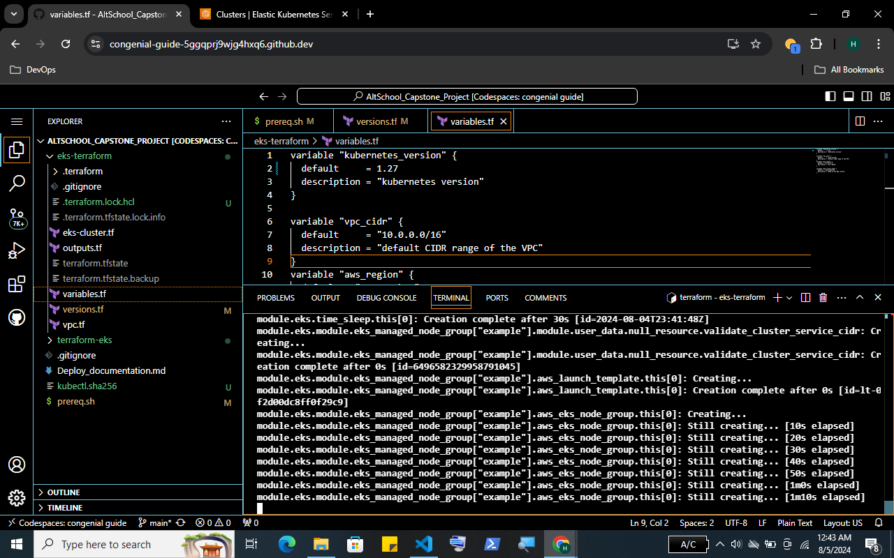
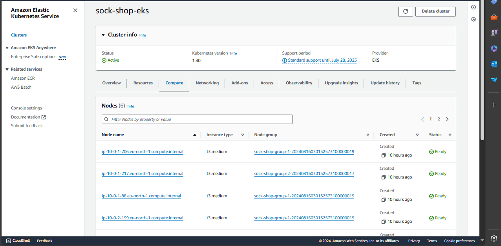
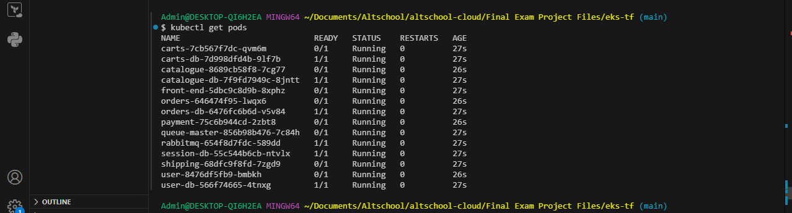
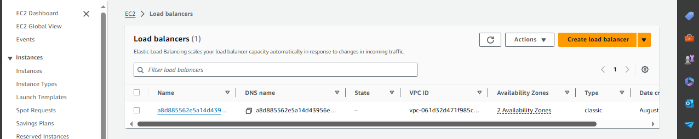
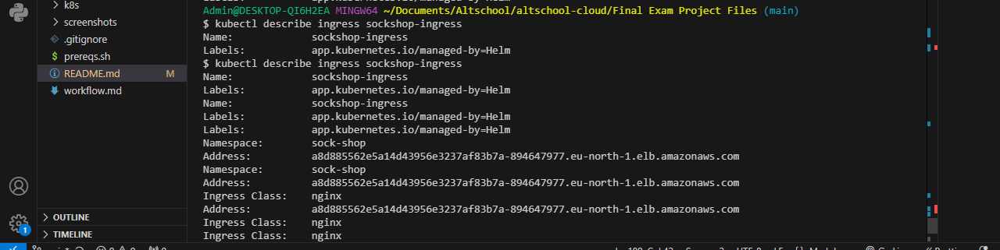
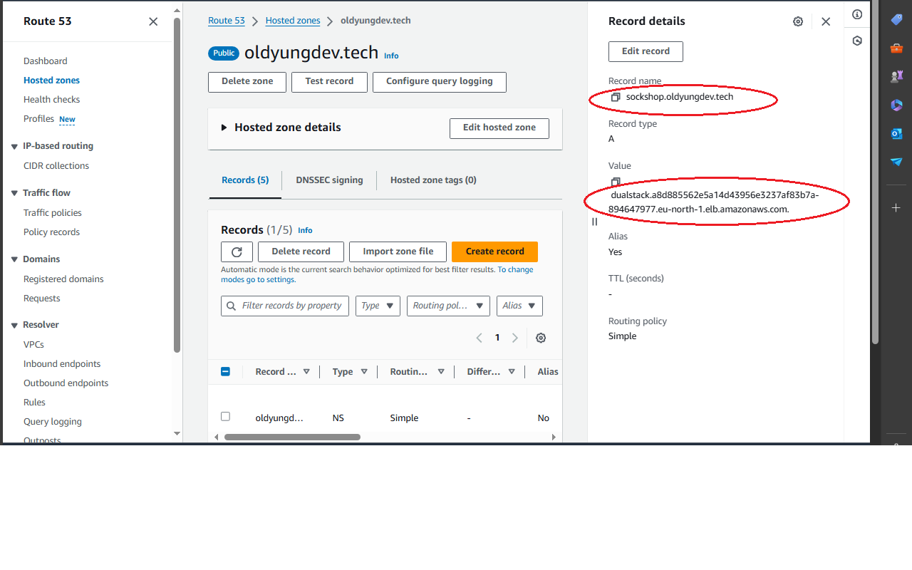
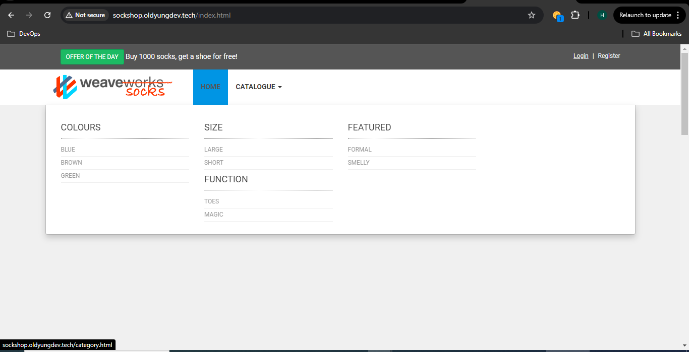
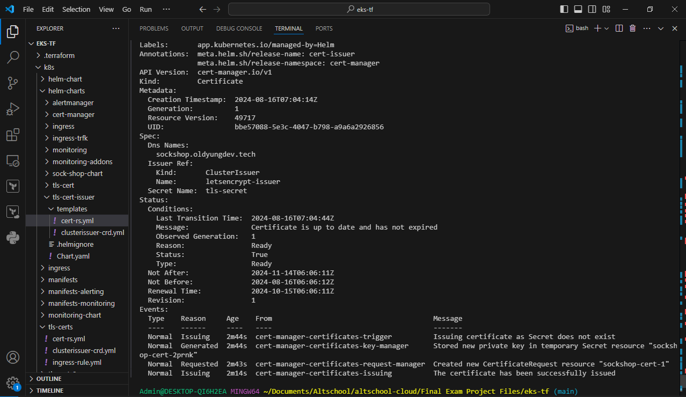
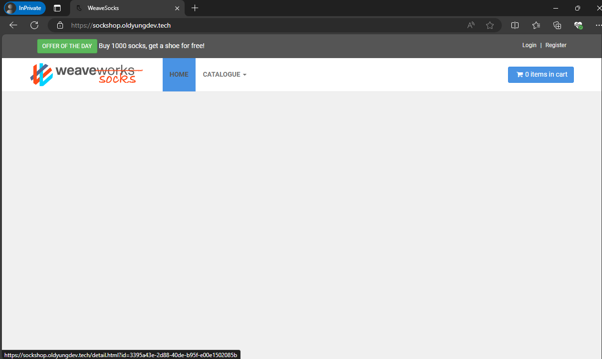

## Sock Shop Microservices Deployment on Kubernetes (*AWS EKS*) Using Terraform (*IaaC*)


*An illustration of the network architecture in which the sock-shop microservice application was deployed*

### Project Objective
This project is carried out in fulfillment of AltSchool of Cloud Engineering Tinyuka 2023 Capstone Project

#### Project Overview
A microservices-based architecture application is deployed on Kubernetes and there’s a need to create a clear IaaC (Infrastructure as Code) deployment to be able to deploy the services in a fast manner.

**Resources**
The microservices app to be deployed and the deployment files are located in the links below...
* Socks Shop Microservices Demo [Github Repo](https://github.com/microservices-demo/microservices-demo.github.io)
* App Deployment Repo [Github Repo](https://github.com/microservices-demo/microservices-demo/tree/master)

**Task Instructions**
* All deliverables need to be deployed using an Infrastructure as Code approach.
* In your solution please emphasize readability and maintainability (make yor application deployment clear)
* We expect a clear way to recreate your setup and will evaluate the project decisions based on:
    - Deploy pipeline
    - Metrics (Alertmanager)
    - Monitoring (Grafana)
    - Logging (Prometheus)
* Use Prometheus as a monitoring tool
* Use Ansible or Terraform as the configuration management tool.
* You can use an IaaS provider of your choice.
* The application should run on Kubernetes


## MY SOLUTION
### Preamble
The SockShop Microservices app is an invention of a company called WeaveWorks to demostrate the microservices architecture paradigm and forster the cloud-native aganda of CNCF (Cloud Native Computing Foundation); a non-profit organization that aims to promote and develop cloud-native technologies, including Kubernetes, Prometheus, and others.

### Pre-requisites
* AWS CLI
* AWS User Account
* Terraform
* Kubectl
* Helm
* Git

To align with the theme of readability and maintainabilty advised on this project, I packaged the pre-requisite installations for this project in a batch script attached [here](./prereqs.sh). This enabled me to use multiple workstation including Github Codespaces.

### Solution Workflow

#### 1.0  Terraform 
Terraform is my IAAC of choice for the project due it's vast array of providers and modules available in the terraform registry which makes configuration and configuration easy.

#### 1.1 Terraform Providers and Modules

My solution workflow involved using terraform to automate the kubernetes cluster provisioning on AWS EKS (Elastic Kubernetes Service). So, my procedural steps involved...

1. Work Evironment Setup...
Created ny project directory and inside the project directory, terraform directory was created for to house terraform modules for the EKS clusters creation. The project file structure is as shown below


├───.github
│   └───workflows
├───eks-tf
├───images
├───k8s
│   ├───helm-charts
│   │   ├───alertmanager
│   │   │   └───templates
│   │   ├───cert-manager
│   │   │   └───templates
│   │   ├───ingress
│   │   │   └───templates
│   │   ├───ingress-trfk
│   │   │   └───templates
│   │   ├───monitoring
│   │   │   └───templates
│   │   ├───monitoring-addons
│   │   │   └───templates
│   │   ├───sock-shop-chart
│   │   │   └───templates
│   │   ├───tls-cert
│   │   │   └───templates
│   │   └───tls-cert-issuer
│   │       └───templates
│   ├───ingress
│   ├───manifests
│   ├───manifests-alerting
│   ├───manifests-monitoring
│   ├───tls-certs
│   └───tls-certs2
└───screenshots

2. AWS EKS cluster configuratiob.....
Using terraform registry vpc modules and kubernetes modules, a secure network architecture was prefered in line with AWS recommended high security and high availability standard. The following diagram captures the network architecture in use for this app deployment.


3. Automating the kubeconfig update and the Sock-shop App namespace creation
I used the power of terrafrom `kubernetes provider` and `local exec` provisioning to automate the kubeconfig file update that synchs the clusters in the cloud with the work environment. These terraform tools also allowed for automation of the app namespace creation and setting of current context to that namespace. The terraform kubernetes provider blocks that made these possible are shown below... 
```
provider "kubernetes" {
    config_path = "~/.kube/config"
}
resource "kubernetes_namespace" "sock_shop" {
    metadata {
      name = "sock-shop"
    }
}
```
With this and the local-exec provisioner, there was no need to manually run the following commands
```
aws eks update-kubeconfig --region <region> --name <cluster-name>
```

The terraform modules are located in the attached [eks-tf](./eks-tf/) sidebar directory.

4. Terraform Apply
After the terraform configuration modules had been prepared, I ran the following commands...
  ```
  cd eks-tf
  terraform init
  terraform validate
  terraform plan
  terraform apply -auto-approve
  ```

 
And below the results of the nodes query after a successful terraform apply.
 ```
 kubectl get nodes
```


Confirming these on AWS console leads to the following screenshot



The nodes are all deployed in the private subnet of the vpc as per the terraform configuration.

#### 2.0 Helm
Helm is a kubernetes package manager which makes managing applications and resources in a kubernetes cluster a breeze. To conform to the ethos of manageability of the project as recommended, I decided to have all the applications and tool deployed by helm and helm alone, except where it was it near impossible to achieve the desired output with helm.

With helm the journey to get the sock-shop app to deployed was made easier with constant installing and uninstalling of releases by simplye install and uninstall commands. Also kept track of how many times a chart used to update a release.

#### 2.1 Sock-shop App Deployment
1. Preparing Sock-shop app chart.
The deployment repo given for this project led the way with a local helm chart for the sock-shop app having all the 14 services and deployment manifest required. So, I simply moved this to my helm-charts [directory](./k8s/helm-charts/)

2. Deploy Sock-shop App with helm
I ran the following helmm command to install my sockshopapp release into the sock-shop namespace (remember had already been automatically created and set to default namespace using terraform configurations).These 

```
helm install sockshopapp ./k8s/helm-charts/
```

And confirmed the pods deployed and running using....
```
kubectl get pods 
```


#### 2.2 Ingress Controller and Ingress Resource
1. Add Ingress Controller from helm Artifact from community using... 
```
helm repo add ingress-nginx https://kubernetes.github.io/ingress-nginx

helm repo update

helm install ingress ingress-nginx/ingress-nginx
```
These commands downloads and adds the nginx controller repo to my local helmm then installs the controller. After installer, a loadbalancer resource is provisioned in the AWS console.....



The load balance is provisioned in the public subnet of the vpc as detailed in the terraform configuration.

2. Write and Install Ingress Resource
An Ingress resource is written and tied to the front-end microservice of app. This will help expose the front-end pod which like all other services is the private subnet and of type clusterIP. Installing the ingress resource was made possible by creating a local helm chart in my helm-chars [directory](./k8s/helm-charts/) with the resource in the template directory.
```
helm create ingress

helm install ingress-ngnix /k8s/helm-charts/ingress/

```
This installs a helm release called ingress-nginx
The installed ingress resources points sock-shop front-end service to the provisioned load balancer as can be seen when I run. The ingress address in the below screenshot is the same as the load balancer and it serves our front-end if no custom domain is available. But since I have a custom domain, I proceeded to using AWS route 53 service next.
 ```
kubectl describe Ingress sockshop-ingress

```


3. Route 53 Hosted Zones for Custom Domain
With the ingress tying the front-end service to the load balance with a public address, next is to use AWS Route 53 hosted zone to create A-Record that would point my custom domain (oldyungdev.tech) to load balancer. This was achieved by using my domain name to create a hosted zone, then have the A-record setting point to the load balancer (using sockshop subdomain) in my region using simple routing protocol.



4. Serving the Front-End on browser
After Route 53 configurations, sockshop.oldyungdev.tech successfully served the front-end, but on the 80 (http) insecure port. 


#### 2.2 TLS Certificate with Helm
1. Add jetstack helm chart from remote repo
```
helm repo add jetstack https://charts.jetstack.io
helm repo update
```

2. Install cert-manager from jetstack helm chart, in the cert-manager namespace.
```
helm install cert-manager jetstack/cert-manager --namespace  cert-manager --create-namespace
```
3. Install ClusterIssuer Custom Resource Definition
Cert Issuer CRD was created and made a local chart using helm create chart. It was saved in the usual helm_charts directory.
Then the following command was run to install in the cert-manager namespace...
```
helm install cert-issuer ./k8s/helm-charts/tls-cert-issuer/ --namespace cert-manager
```

4. Install certificate resource
Similarly a certificate resource was created and made into local helm chart, then installed, this time in the sock-shop namespace
```
helm install sockshop-cert ./k8s/helm-charts/tls-cert/ --namespace sock-shop
```

5. Check for Certificate Issuance
```
kubectl get certificate
kubectl describe certitificate sockshop-cert 
```
with the above commands I was able to inspect my certificate status, and voila! It was issued.


6. Confirm fron-end serving on https (port 445)

