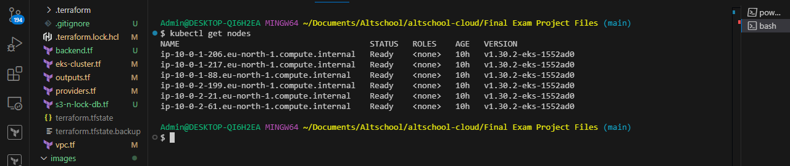

## Sock Shop Microservices Deployment on Kubernetes (*AWS EKS*) Using Terraform (*IaaC*)


*An illustration of the network architecture in which the sock-shop microservice application was deployed*

### Project Objective
This project is carried out in fulfillment of AltSchool of Cloud Engineering Tinyuka 2023 Capstone Project

#### Project Overview
A microservices-based architecture application is deployed on Kubernetes and there’s a need to create a clear IaaC (Infrastructure as Code) deployment to be able to deploy the services in a fast manner.

**Resources**
The microservices app to be deployed and the deployment files are located in the links below...
* Socks Shop Microservices Demo [Github Repo](https://github.com/microservices-demo/microservices-demo.github.io)
* App Deployment Repo [Github Repo](https://github.com/microservices-demo/microservices-demo/tree/master)

**Task Instructions**
* All deliverables need to be deployed using an Infrastructure as Code approach.
* In your solution please emphasize readability and maintainability (make yor application deployment clear)
* We expect a clear way to recreate your setup and will evaluate the project decisions based on:
    - Deploy pipeline
    - Metrics (Alertmanager)
    - Monitoring (Grafana)
    - Logging (Prometheus)
* Use Prometheus as a monitoring tool
* Use Ansible or Terraform as the configuration management tool.
* You can use an IaaS provider of your choice.
* The application should run on Kubernetes


## MY SOLUTION
### Preamble
The SockShop Microservices app is an invention of a company called WeaveWorks to demostrate the microservices architecture paradigm and forster the cloud-native aganda of CNCF (Cloud Native Computing Foundation); a non-profit organization that aims to promote and develop cloud-native technologies, including Kubernetes, Prometheus, and others.

### Pre-requisites
* AWS CLI
* AWS User Account
* Terraform
* Kubectl
* Helm
* Git

To align with the theme of readability and maintainabilty advised on this project, I packaged the pre-requisite installations for this project in a batch script attached [here](./prereqs.sh). This enabled me to use multiple workstation including Github Codespaces.

### Solution Workflow

#### 1.0  Terraform 
Terraform is my IAAC of choice for the project due it's vast array of providers and modules available in the terraform registry which makes configuration and configuration easy.

#### 1.1 Terraform Providers and Modules

My solution workflow involved using terraform to automate the kubernetes cluster provisioning on AWS EKS (Elastic Kubernetes Service). So, my procedural steps involved...

1. Work Evironment Setup...
Created ny project directory and inside the project directory, terraform directory was created for to house terraform modules for the EKS clusters creation. The project file structure is as shown below


├───.github
│   └───workflows
├───eks-tf
├───images
├───k8s
│   ├───helm-charts
│   │   ├───alertmanager
│   │   │   └───templates
│   │   ├───cert-manager
│   │   │   └───templates
│   │   ├───ingress
│   │   │   └───templates
│   │   ├───ingress-trfk
│   │   │   └───templates
│   │   ├───monitoring
│   │   │   └───templates
│   │   ├───monitoring-addons
│   │   │   └───templates
│   │   ├───sock-shop-chart
│   │   │   └───templates
│   │   ├───tls-cert
│   │   │   └───templates
│   │   └───tls-cert-issuer
│   │       └───templates
│   ├───ingress
│   ├───manifests
│   ├───manifests-alerting
│   ├───manifests-monitoring
│   ├───tls-certs
│   └───tls-certs2
└───screenshots

2. AWS EKS cluster configuratiob.....
Using terraform registry vpc modules and kubernetes modules, a secure network architecture was prefered in line with AWS recommended high security and high availability standard. The following diagram captures the network architecture in use for this app deployment.


3. Automating the kubeconfig update and the Sock-shop App namespace creation
I used the power of terrafrom `kubernetes provider` and `local exec` provisioning to automate the kubeconfig file update that synchs the clusters in the cloud with the work environment. These terraform tools also allowed for automation of the app namespace creation and setting of current context to that namespace. The terraform kubernetes provider blocks that made these possible are shown below... 
```
provider "kubernetes" {
    config_path = "~/.kube/config"
}
resource "kubernetes_namespace" "sock_shop" {
    metadata {
      name = "sock-shop"
    }
}
```
With this and the local-exec provisioner, there was no need to manually run the following commands
```
aws eks update-kubeconfig --region <region> --name <cluster-name>
```

The terraform modules are located in the attached [eks-tf](./eks-tf/) sidebar directory.

4. Terraform Apply
After the terraform configuration modules had been prepared, I ran the following commands...
  ```
  cd eks-tf
  terraform init
  terraform validate
  terraform plan
  terraform apply -auto-approve
  ```

 
And below the results of the nodes query after a successful terraform apply.
 ```
 kubectl get nodes
```


Confirming these on AWS console leads to the following screenshot


The nodes are all deployed in the private subnet of the vpc as per the terraform configuration.

#### 2.0 Helm
Helm is a kubernetes package manager which makes managing applications and resources in a kubernetes cluster a breeze. To conform to the ethos of manageability of the project as recommended, I decided to have all the applications and tool deployed by helm and helm alone, except where it was it near impossible to achieve the desired output with helm.

With helm the journey to get the sock-shop app to deployed was made easier with constant installing and uninstalling of releases by simplye install and uninstall commands. Also kept track of how many times a chart used to update a release.

#### 2.1 Sock-shop App Deployment
1. Preparing Sock-shop app chart.
The deployment repo given for this project led the way with a local helm chart for the sock-shop app having all the 14 services and deployment manifest required. So, I simply moved this to my helm-charts [directory](./k8s/helm-charts/)

2. Deploy Sock-shop App with helm
I ran the following helmm command to install my sockshopapp release into the sock-shop namespace (remember had already been automatically created and set to default namespace using terraform configurations).These 

```
helm install sockshopapp ./k8s/helm-charts/
```

And confirmed the pods deployed and running using....
```
kubectl get pods 
```


#### 2.2 Ingress Controller and Ingress Resource
1. Add Ingress Controller from helm Artifact from community using... 
```
helm repo add ingress-nginx https://kubernetes.github.io/ingress-nginx

helm repo update

helm install ingress ingress-nginx/ingress-nginx
```
These commands downloads and adds the nginx controller repo to my local helmm then installs the controller. After installer, a loadbalancer resource is provisioned in the AWS console.....


The load balance is provisioned in the public subnet of the vpc as detailed in the terraform configuration.

2. Write and Install Ingress Resource
An Ingress resource is written and tied to the front-end microservice of app. This will help expose the front-end pod which like all other services is the private subnet and of type clusterIP. Installing the ingress resource was made possible by creating a local helm chart in my helm-chars [directory](./k8s/helm-charts/) with the resource in the template directory.
```
helm create ingress

helm install ingress-ngnix /k8s/helm-charts/ingress/

```
This installs a helm release called ingress-nginx

3. 

git clone https://github.com/microservices-demo/microservices-demo
cd microservices-demo
```

### Start Minik

You can start Minikube by running:

```
minikube start --memory 8192 --cpus 4
```

Check if it's running with `minikube status`, and make sure the Kubernetes dashboard is running on http://192.168.99.100:30000.

Approximately 4 GB of RAM is required to run all the services.

##### *(Optional)* Run with Fluentd + ELK based logging

If you want to run the application using a more advanced logging setup based on Fluentd + ELK stack, there are 2 requirements:
* assign at least 6 GB of memory to the minikube VM
* increase vm.max_map_count to 262144 or higher (Required because Elasticsearch will not start if it detects a value lower than 262144).

```
minikube delete
minikube config set memory 6144
minikube start
minikube ssh
```

Once logged into the VM:

```
$ sudo sysctl -w vm.max_map_count=262144
```

After these settings are done you can start the logging manifests.

```
kubectl create -f deploy/kubernetes/manifests-logging
```

You should be able to see the Kibana dashboard at http://192.168.99.100:31601.

### Deploy Sock Shop

Deploy the Sock Shop application on Minikube

```
kubectl create -f deploy/kubernetes/manifests/sock-shop-ns.yaml -f deploy/kubernetes/manifests
```

To start Opentracing run the following command after deploying the sock shop
```
kubectl apply -f deploy/kubernetes/manifests-zipkin/zipkin-ns.yaml -f deploy/kubernetes/manifests-zipkin
```

Wait for all the Sock Shop services to start:

```
kubectl get pods --namespace="sock-shop"
```

### Check the Sock Shop webpage

Once the application is deployed, navigate to http://192.168.99.100:30001 to see the Sock Shop home page.

### Opentracing

Zipkin is part of the deployment and has been written into some of the services.  While the system is up you can view the traces in
Zipkin at http://192.168.99.100:30002.  Currently orders provide the most comprehensive traces, but this requires a user to place an order.

### Run tests

There is a separate load-test available to simulate user traffic to the application. For more information see [Load Test](#loadtest).
This will send some traffic to the application, which will form the connection graph that you can view in Scope or Weave Cloud. You should
also check what ip your minikube instance has been assigned and use that in the load test.

```
minikube ip
docker run --rm weaveworksdemos/load-test -d 5 -h 192.168.99.100:30001 -c 2 -r 100
```

### Uninstall the Sock Shop application

```
kubectl delete -f deploy/kubernetes/manifests/sock-shop-ns.yaml -f deploy/kubernetes/manifests
```

If you don't need the Minikube instance anymore you can delete it by running:

```
minikube delete
```
